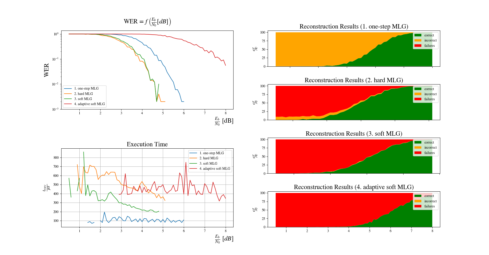

  

# Iterative Channel Coding

## Introduction

A quantitative comparison of different iterative decoding algorithms applied to
classical channel code descriptions. Implemented algorithms are:

| Code Type      | Code                |
| -------------- | ------------------- |
| orthogonal     | one-step MLG        |
| orthogonal     | hard MLG            |
| orthogonal     | soft MLG            |
| orthogonal     | adaptive soft MLG   |
| non-orthogonal | BF                  |
| non-orthogonal | WBF                 |
| non-orthogonal | MWBF                |
| non-orthogonal | IMWBF               |
| non-orthogonal | Min Sum             |
| non-orthogonal | normalized Min Sum  |
| non-orthogonal | offset Min Sum      |

## Running Demos
Run `make demo` to see the decoding schemes in action.

## Running Benchmarks
Run `make benchmark` to run the decoding performance benchmarks for the code
descriptions given in `resources/control_matrices.txt`. Results are placed
per code in appropriately named subfolders of the `benchmarks` directory. They
can be visualized by invoking the `tool/plot` script with one of the subfolders
as the first command line argument.
